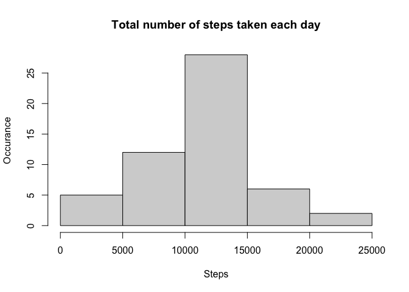
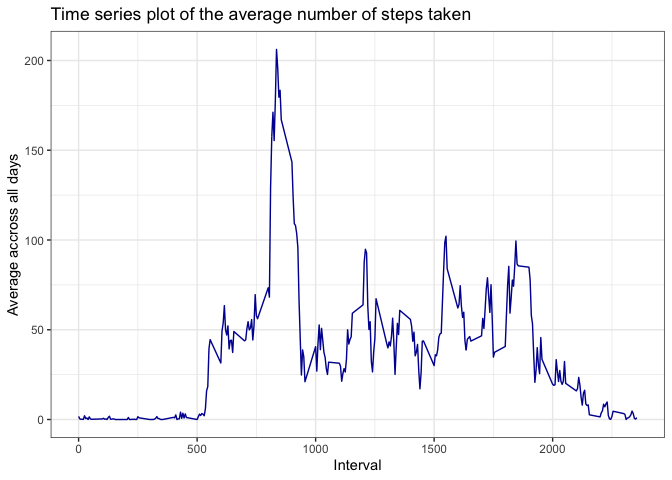
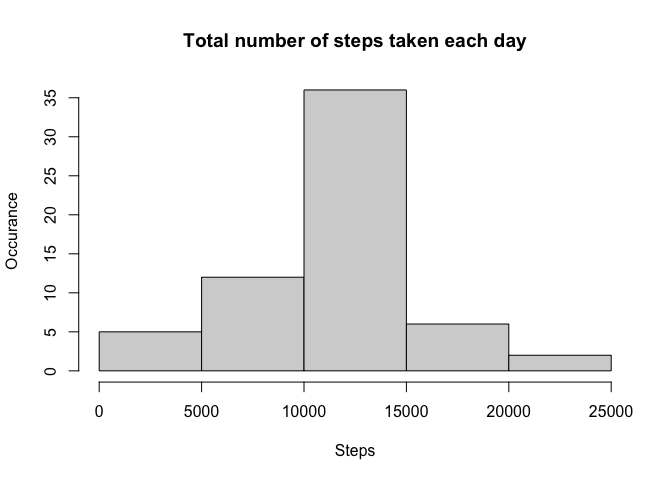
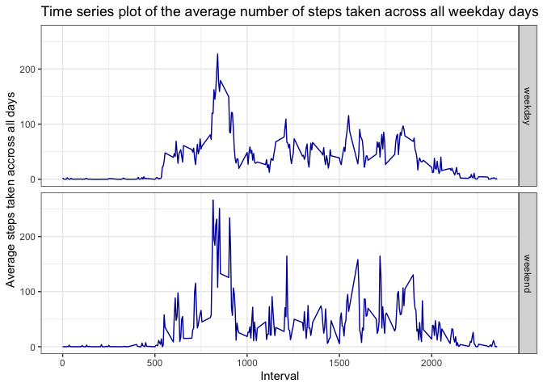

--------------------------------------------------------------------------------

Welcome to the Reproducible Research: Peer Assessment 1 assignment report. Data for this assignment is taken from http://github.com/rdpeng/RepData_PeerAssessment1 and the file used in this assignment is activity.csv. Decompression on activity.zip was performed manually. Heading 2 texts below (1 to 5) mark the questions this assignment is trying to answer for activity data set. 

Libraries used to produce this Rmarkdown file:

1. `library(scales)`
2. `library(ggplot2)`
3. `library(dplyr)`
4. `library(lattice)`

## Quick Checks

```r
  getwd()
```

```
## [1] "/Volumes/Work/R/Projects/WorkDir/RepData_PeerAssessment1"
```

```r
  file.exists("activity.csv")
```

```
## [1] TRUE
```

## 1. Loading and preprocessing the data

#### 1.1 Reading data

Activity data set will be read into R using `read.csv' function.


```r
  activity <- read.csv("activity.csv")
```

Check structure of the data frame to familiarize yourself with column names and data types etc.


```r
  str(activity)
```

```
## 'data.frame':	17568 obs. of  3 variables:
##  $ steps   : int  NA NA NA NA NA NA NA NA NA NA ...
##  $ date    : chr  "2012-10-01" "2012-10-01" "2012-10-01" "2012-10-01" ...
##  $ interval: int  0 5 10 15 20 25 30 35 40 45 ...
```

**Observations from `str` command above:**  

Percentage of `NA` in activity data frame  


```r
label_percent()(mean(is.na(activity)))
```

```
## [1] "4%"
```

Dates are of type character and needs treatment  

#### 1.2 Processing/Transforming data


Adding a new column in data frame with correct date type:


```r
activity$new.date <- as.Date(strptime(activity$date, format="%Y-%m-%d"))
```

Check structure of the data frame to familiarize yourself with column names and data types etc. once again.


```r
  str(activity)
```

```
## 'data.frame':	17568 obs. of  4 variables:
##  $ steps   : int  NA NA NA NA NA NA NA NA NA NA ...
##  $ date    : chr  "2012-10-01" "2012-10-01" "2012-10-01" "2012-10-01" ...
##  $ interval: int  0 5 10 15 20 25 30 35 40 45 ...
##  $ new.date: Date, format: "2012-10-01" "2012-10-01" ...
```

Data frame `activity` looks good for answering the question below.

## 2. What is mean total number of steps taken per day?


#### 2.1 Calculate the total number of steps taken per day


The idea to calculate the steps taken per day is to group the data frame by individual dates and by applying sum function over steps and filtering out any missing values from steps variable. To me, `dplyr`'s group by and filter seems best fit for the job.


```r
  mean.total.steps <- activity %>% group_by(new.date) %>% filter(!is.na(steps)) %>% summarise(steps = sum(steps))
```

Check out newly created data frame `mean.total.steps` and analyze the data if filter on NAs and grouping on date has worked as per our expectation.


```r
  str(mean.total.steps)
```

```
## tibble [53 × 2] (S3: tbl_df/tbl/data.frame)
##  $ new.date: Date[1:53], format: "2012-10-02" "2012-10-03" ...
##  $ steps   : int [1:53] 126 11352 12116 13294 15420 11015 12811 9900 10304 17382 ...
```

```r
  label_percent()(mean(is.na(mean.total.steps)))
```

```
## [1] "0%"
```

#### 2.2 Make a histogram of the total number of steps taken each day

> The key difference between bar chart and histogram is that the bar chart shows categorical data whereas histogram shows quantity.


```r
  hist(mean.total.steps$steps, main = "Total number of steps taken each day", xlab = "Steps", ylab = "Occurance")
```

<!-- -->

#### 2.3 Calculate and report the mean and median of the total number of steps taken per day


```r
  mean.total.steps.result <- mean(mean.total.steps$steps)
  median.total.steps.result <- median(mean.total.steps$steps)
```

Mean 10766.19 and median 10765 number of steps taken per day.

## 3. What is the average daily activity pattern?

Utilizing the aggregation from point 2 above by changing the function in summarize clause. Using `ggplot` to plot a histogram

#### 3.1 Time series plot of the 5-minute interval (x-axis) and the average number of steps taken, averaged across all days (y-axis)


```r
  activity.pattern <- activity %>% group_by(interval) %>% filter(!is.na(steps)) %>% summarise(steps = mean(steps))
  ggplot(activity.pattern, aes(x=interval, y=steps, fill=steps)) + geom_line(color="#0313a1") + theme_bw() + labs(title = "Time series plot of the average number of steps taken") + xlab("Interval") + ylab("Average accross all days")
```

<!-- -->

#### 3.2 Which 5-minute interval, on average across all the days in the dataset, contains the maximum number of steps


```r
  ordered.activity.pattern <- activity.pattern %>% arrange(desc(steps))
  max.interval <- as.integer(ordered.activity.pattern[1,1])
  max.interval
```

```
## [1] 835
```

835 is the 5-minute interval accross all the days with maximum number of steps

## 4. Imputing missing values

#### 4.1 Calculate and report the total number of missing values in the dataset

Following object shows the different missing values for activity data frame:


```r
  all.nas <- sum(is.na(activity))
  all.nas
```

```
## [1] 2304
```

#### 4.2 Devise a strategy for filling in all of the missing values in the dataset

Strategy is simple:  

  1. create a new data frame aggregated by `interval` and with no missing values in `steps`  
  2. Merge the original `activity` data frame with the new data frame  
  3. replace the missing values in `steps` with the brought over mean of intervals for a day.


```r
  agg.dataframe <- activity %>% group_by(interval) %>% filter(!is.na(steps)) %>% summarise(steps = mean(steps))
```

#### 4.3 Create a new dataset that is equal to the original dataset but with the missing data filled in.


```r
  new.merged.dataframe <- merge(activity, agg.dataframe, by = "interval", all.x = TRUE)
  new.merged.dataframe <- new.merged.dataframe %>% select(new.date, interval, steps.x, steps.y) %>% arrange(new.date) %>% mutate(steps.x = ifelse(is.na(steps.x),steps.y,steps.x))
  new.dataframe <- new.merged.dataframe %>% select(new.date, interval, steps.x)
```

Clean up


```r
    rm(agg.dataframe)
    rm(new.merged.dataframe)
```

#### 4.4 Make a histogram of the total number of steps taken each day and Calculate and report the mean and median total number of steps taken per day. Do these values differ from the estimates from the first part of the assignment? What is the impact of imputing missing data on the estimates of the total daily number of steps?


```r
  mean.total.new.steps <- new.dataframe %>% group_by(new.date) %>% summarise(steps.x = sum(steps.x))
  hist(mean.total.new.steps$steps.x, main = "Total number of steps taken each day", xlab = "Steps", ylab = "Occurance")
```

<!-- -->

Calculating `mean` and `median`


```r
  mean.total.steps.new.result <- mean(mean.total.new.steps$steps.x)
  median.total.steps.new.result <- median(mean.total.new.steps$steps.x)
```

Mean 10766.19 and median 10766.19 number of steps taken per day. Only median value differ from the estimates from the first part. The difference in median is:


```r
  median.total.steps.new.result - median.total.steps.result
```

```
## [1] 1.188679
```

The impact of imputing missing data is that the median has increased slightly.

## 5. Are there differences in activity patterns between weekdays and weekends?

#### 5.1 Create a new factor variable in the dataset with two levels – “weekday” and “weekend” indicating whether a given date is a weekday or weekend day.

Adding a new variable into data frame as factor with two levels by using `weekday` function and using simple is and else to assign string `weekday` or `weekend` depending on returned day of the week.


```r
  new.dataframe$day.type <- as.factor(ifelse((weekdays(mean.total.new.steps$new.date) == "Saturday" | weekdays(mean.total.new.steps$new.date) == "Sunday"),"weekend","weekday"))
```

#### 5.2 Make a panel plot containing a time series plot (i.e.type = "l") of the 5-minute interval (x-axis) and the average number of steps taken, averaged across all weekday days or weekend days (y-axis)

Using ggplot system for this plot. **Note that factors levels `weekdays` and `weekend` will be on right hand side of the chart instead on the top as the example shows on [Example plot](https://github.com/rdpeng/RepData_PeerAssessment1). This is a default ggplot behavior.**


```r
  new.dataframe.plot <- new.dataframe %>% group_by(day.type,interval) %>% summarise(steps.x = mean(steps.x))
  ggplot(new.dataframe.plot, aes(x=interval, y=steps.x)) + geom_line(color="#0313a1") + theme_bw() + labs(title = "Time series plot of the average number of steps taken across all weekday days or weekend days") + xlab("Interval") + ylab("Average steps taken accross all days") + facet_grid(rows = vars(day.type))
```

<!-- -->

**End of the report**  
